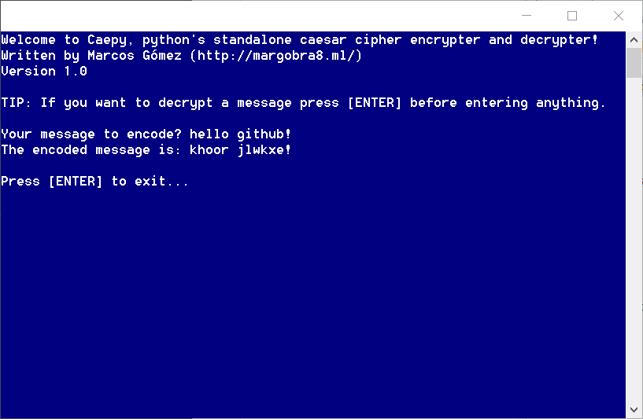

# [Caepy](https://github.com/margobra8/Caepy/releases)

**[Caesar cipher](https://en.wikipedia.org/wiki/Caesar_cipher) encryption and decryption** utility that runs in standalone **python** and **executable** file.

----------

Information
-------------

> **Current build status:**

> - *14 August 2016.*
>   - v1.0 has been released! ***Download it [here](https://github.com/margobra8/Caepy/releases)***!

Installation
------------

Caepy is compatible with the following environments:

 - Any OS that runs **`Python 3.5`**:
	 - Caepy actually uses no external modules/libraries so a clean install of it is enough to run it seamlessly.
 - Windows XP/Vista/7/8+/10:
	 - From installer installation
	 - From zip package

Future improvements
-----------

 - GUI
 - OSX/macOS .dmg
 - More surprises
 